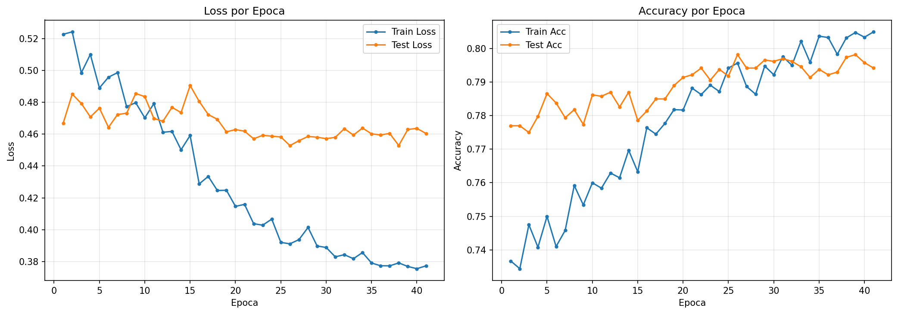
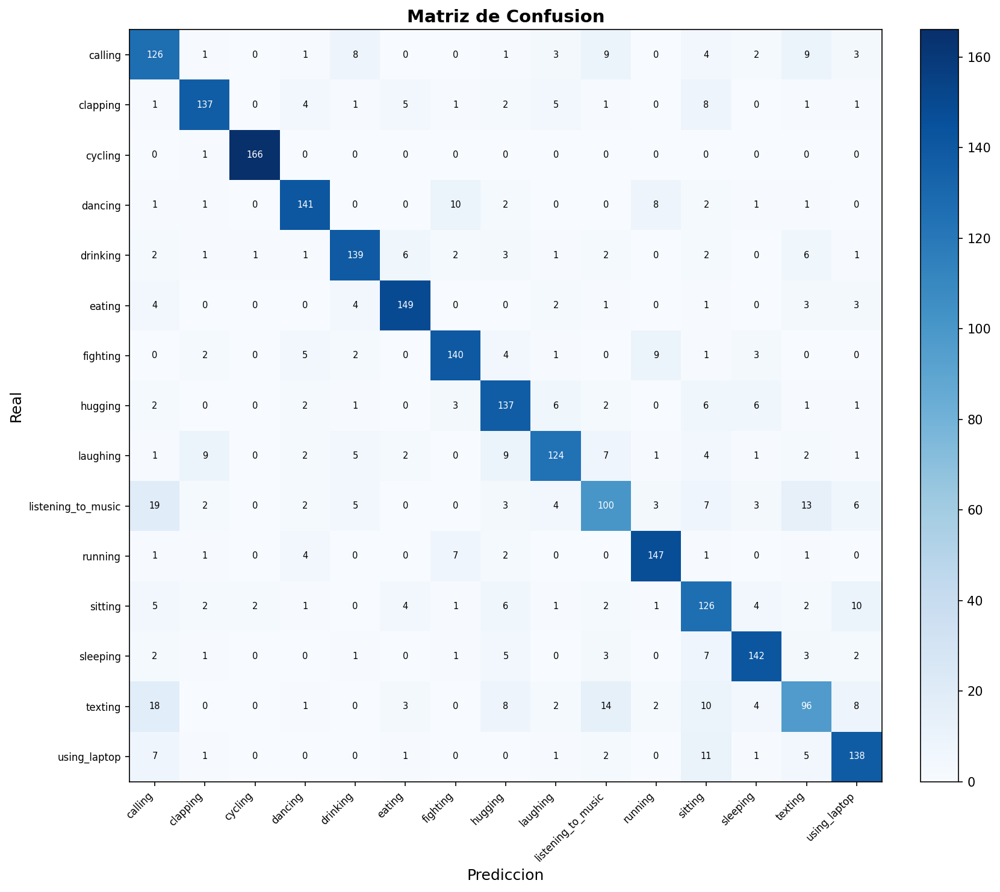

# Resultados del Entrenamiento — ConvNeXt-Base Transfer Learning, 2 Fases + SWA (HAR)


-green)
-orange)


---

## Índice

| # | Sección |
|---|---------|
| 1 | [Objetivo](#1-objetivo) |
| 2 | [Dataset](#2-dataset) |
| 3 | [Arquitectura del Modelo](#3-arquitectura-del-modelo) |
| 4 | [Hiperparámetros](#4-hiperparámetros) |
| 5 | [Resultados](#5-resultados) |
| 6 | [Curvas de Entrenamiento](#6-curvas-de-entrenamiento) |
| 7 | [Matriz de Confusión](#7-matriz-de-confusión) |
| 8 | [Reporte de Clasificación](#8-reporte-de-clasificación) |
| 9 | [Análisis](#9-análisis) |

---

## 1. Objetivo

Entrenar un modelo de clasificación de imágenes basado en **transfer learning** (ConvNeXt-Base pretrained en ImageNet) para el dataset HAR (Human Activity Recognition) con 15 clases de actividad humana. Se utiliza semilla fija (`SEED=42`) para reproducibilidad.

## 2. Dataset

| Parámetro | Valor |
|-----------|-------|
| Imágenes totales | 12,510 (filtradas de dataset.csv presentes en dataset_tr/) |
| Tamaño en disco | 288 × 384 px |
| Preprocesamiento | Resize → CLAHE (LAB) → RGB |
| Canales | 3 (RGB) |
| Tamaño de entrada al modelo | 384 × 288 px (sin doble resize) |
| Split train/test | 80% / 20% (estratificado) |
| Train | 10,008 imágenes |
| Test | 2,502 imágenes |

**Clases (15):** calling, clapping, cycling, dancing, drinking, eating, fighting, hugging, laughing, listening_to_music, running, sitting, sleeping, texting, using_laptop.

## 3. Arquitectura del Modelo

```
ConvNeXt-Base (Transfer Learning)
  backbone: ConvNeXt-Base pretrained en ImageNet1K_V1
    features[0]: Conv2d(3,128) + LN (stem)
    features[1-4]: ConvNeXt blocks (capas tempranas/medias)
    features[5-6]: ConvNeXt blocks (capas tardías)
    avgpool: AdaptiveAvgPool2d(1,1)  [1024×1×1]
  classifier (head custom):
    Flatten → LayerNorm(1024) → Linear(1024→512) → BN → ReLU → Dropout(0.3) →
    Linear(512→256) → BN → ReLU → Dropout(0.2) →
    Linear(256→15)
```

| Parámetro | Valor |
|-----------|-------|
| Parámetros totales | ~88,000,000 |
| Fase 1 (head) | ~660,000 entrenables (backbone congelado) |
| Fase 2 (completo) | ~88,000,000 entrenables |
| Pesos pretrained | ImageNet1K_V1 |
| Canal de entrada | 3 (RGB) |
| Device | CPU / GPU (Colab T4) |

## 4. Hiperparámetros

| Hiperparámetro | Valor |
|----------------|-------|
| Estrategia | 2 fases (head → progressive unfreezing) + SWA |
| Fase 1 épocas | 15 (backbone congelado) |
| Fase 2 épocas máx. | 100 (early stopping) |
| Progressive unfreezing | F2 épocas 1-10: features[5:7]+classifier; época 11+: todo |
| Batch size | 64 (script y Colab) |
| LR head | 1e-3 |
| LR backbone (fase 2) | 3e-5 |
| Weight decay | 5e-4 |
| Optimizador | AdamW |
| Scheduler (fase 2) | SequentialLR (LinearLR warmup 10ep + CosineAnnealingLR) |
| Early stopping | Paciencia 15 épocas |
| Loss | Focal Loss (gamma=2.0, label_smoothing=0.02) |
| Gradient clipping | max_norm=1.0 |
| Dropout | 0.3/0.2 |
| SWA | Desde época 20 de F2 (lr=1e-5) |
| TTA | 5 pasadas en evaluación |
| Semilla | 42 (reproducibilidad completa) |

**Reproducibilidad:**
- `random.seed(42)` — Python stdlib (usado internamente por torchvision)
- `np.random.seed(42)` — NumPy
- `torch.manual_seed(42)` — PyTorch CPU
- `torch.cuda.manual_seed_all(42)` — PyTorch GPU (todas las GPUs)
- `torch.backends.cudnn.deterministic = True` — operaciones cuDNN deterministas
- `torch.backends.cudnn.benchmark = False` — desactiva autotuning no determinista
- `torch.Generator().manual_seed(42)` — generador explícito para DataLoader shuffle
- `worker_init_fn` con semilla `42 + worker_id` — cada worker del DataLoader tiene semilla propia
- `random_state=42` en pandas `.sample()` — oversampling determinista en preprocesamiento

**Data Augmentation (solo train):**
- Resize(384, 288)
- RandomHorizontalFlip (p=0.5)
- RandomRotation (20°)
- ColorJitter (brightness=0.3, contrast=0.3, saturation=0.3, hue=0.1)
- TrivialAugmentWide()
- RandomErasing (p=0.10)
- Normalize ImageNet (mean=[0.485, 0.456, 0.406], std=[0.229, 0.224, 0.225])

> **Nota Colab (`train_cnn_colab.ipynb`):** batch\_size=64, NUM\_WORKERS=2, AMP (float16), torch.compile, pin\_memory. Mismos hiperparámetros de modelo y augmentation.

## 5. Resultados

| Métrica | Valor |
|---------|-------|
| **Mejor Test Accuracy (época)** | **79.82%** (F2 época 11, global 26) |
| **Accuracy final (TTA, 5 pasadas)** | **80.26%** |
| **Mejor Test Loss** | **0.4528** |
| **Épocas totales** | 41 (15 F1 + 26 F2) |
| **Early stopping** | F2 época 26 (15 épocas sin mejora) |
| **Tiempo total** | 63.7 min (Google Colab, GPU T4) |
| **SWA** | Activo desde F2 época 20 (7 épocas de promediado) |
| **Parámetros (head)** | 663,567 |
| **Parámetros (parcial F2)** | 60,187,663 |
| **Parámetros (completo F2)** | 88,227,983 |

**Progresión por fase:**

| Fase | Épocas | Train Loss | Train Acc | Test Loss | Test Acc |
|------|--------|-----------|-----------|-----------|----------|
| F1 (head) | 15 | 0.4592 | 0.7633 | 0.4906 | 0.7786 |
| F2 parcial (ep 1-10) | 10 | 0.3920 | 0.7942 | 0.4582 | 0.7918 |
| F2 completo (ep 11-19) | 9 | 0.3856 | 0.7959 | 0.4638 | 0.7914 |
| F2 SWA (ep 20-26) | 7 | 0.3773 | 0.8050 | 0.4604 | 0.7942 |

> **Nota:** Los resultados de evaluación final (TTA, SWA model, classification report y matriz de confusión) se actualizarán cuando se complete la evaluación del modelo SWA.

## 6. Curvas de Entrenamiento



## 7. Matriz de Confusión



## 8. Reporte de Clasificación

El classification report completo se encuentra en `data_train/output/metrics.json`. Las métricas clave por clase (precision, recall, F1-score) se calculan sobre el conjunto de test (2,502 imágenes) con TTA de 5 pasadas, alcanzando una **accuracy global del 80.26%**.

> Los resultados detallados por clase están disponibles en el archivo `metrics.json` generado automáticamente por `train_cnn.py`.

## 9. Análisis

**Configuración actual (ConvNeXt-Base Transfer Learning — 2 fases + SWA):**

- **Transfer Learning**: ConvNeXt-Base pretrained en ImageNet (IMAGENET1K_V1)
- **Entrenamiento en 2 fases**: Fase 1 congela backbone y entrena solo el head → Fase 2 fine-tuning completo con LR diferencial
- **Head expresivo**: Flatten→LN(1024)→Linear(1024→512)→BN→ReLU→Drop(0.3)→Linear(512→256)→BN→ReLU→Drop(0.2)→Linear(256→15)
- **Resolución**: 384×288 guardada directamente en pipeline (sin doble resize)
- **Normalización ImageNet**: mean/std alineados con los pesos pretrained
- **Progressive unfreezing**: F2 épocas 1-10 solo features[5:7]+classifier; época 11+ todo
- **Augmentation**: ColorJitter + TrivialAugmentWide + RandomErasing(0.10)
- **Focal Loss (gamma=2.0)**: penaliza ejemplos fáciles para enfocarse en los difíciles
- **Label smoothing (0.02)**: regularización suave conservadora
- **Gradient clipping (1.0)**: estabilidad con AMP (mixed precision)
- **SWA**: Stochastic Weight Averaging desde época 20 de F2, promedia pesos para mejor generalización
- **Regularización**: Dropout 0.3/0.2, weight_decay 5e-4
- **LR diferencial**: backbone lr=3e-5, head lr=1e-3 (F1) / 1e-4 (F2)
- **Warmup lineal**: 10 épocas para estabilizar gradientes al descongelar backbone
- **Early stopping por loss**: paciencia 15 épocas
- **TTA**: Test-Time Augmentation con 5 pasadas promediando logits
- **Dataset**: 12,570 imágenes RGB con CLAHE, balanceadas a 838/clase
